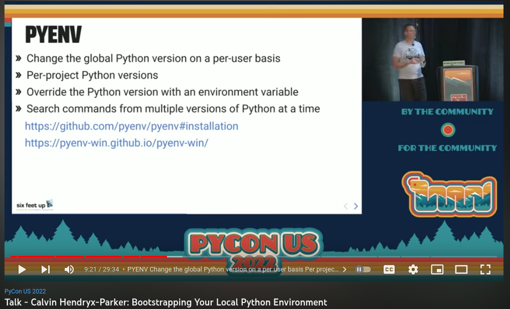

```{comment}
# Install Python

##

<center>

</center>


## Installing Python is Easy!

::: columns
::: {.column width="50%"}
But...

- System vs Installed
- Python Versions
    - Updating
    - Multiple versions
:::

::: {.column width="50%"}

:::
:::

## Installing Python Packages is Easy!


::: columns
::: {.column width="50%"}
`pip install pandas`

But...

- Where?
- Installing "everything"
- Dependency + Version management
    - Virtual environments
:::

::: {.column width="50%"}

:::
:::


## 

## Python: Pyenv



[Calvin Hendryx-Parker - Bootstrapping Your Local Python Environment](https://www.youtube.com/watch?v=-YEUFGFHWgQ)


## Packages: built-in `venv`

[PEP 405: Python Virtual Environments](https://peps.python.org/pep-0405/)

- Barebones
- Comes with Python (standard library)
- Recommended as of Python 3.5+

## Packages: `pyenv-virtualenv`

- `pyenv` plugin
- Uses `venv`
- Quality of life improvements over plain venv

- Downside: Does not have Windows support

## Packages: Pipenv

-   Hitchhiker's Guide to Python
-   https://docs.python-guide.org/dev/virtualenvs/
-   Real Python: https://realpython.com/pipenv-guide/

## Packages: `conda`
```